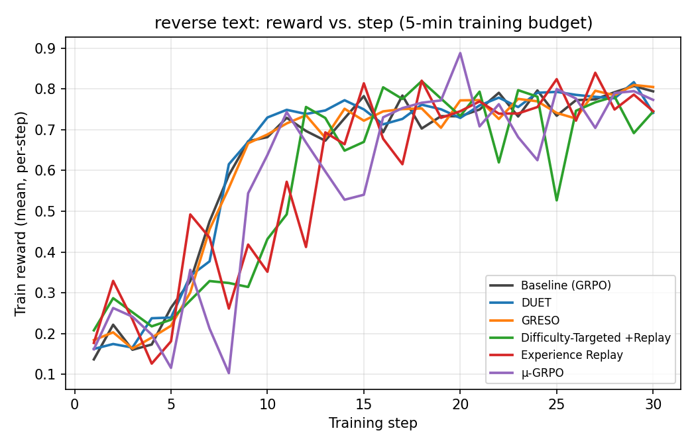
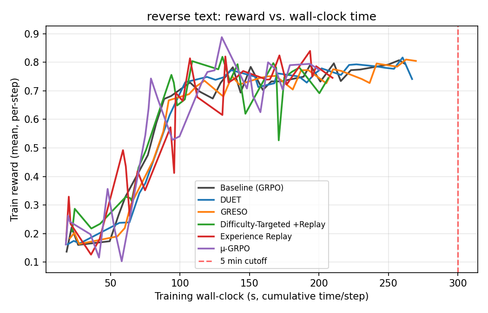
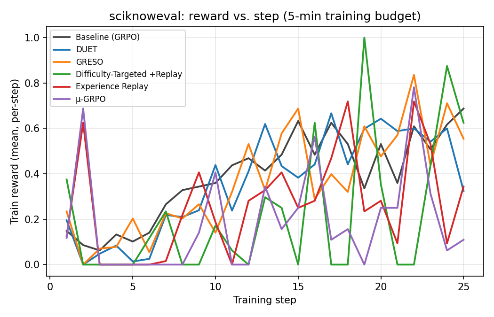
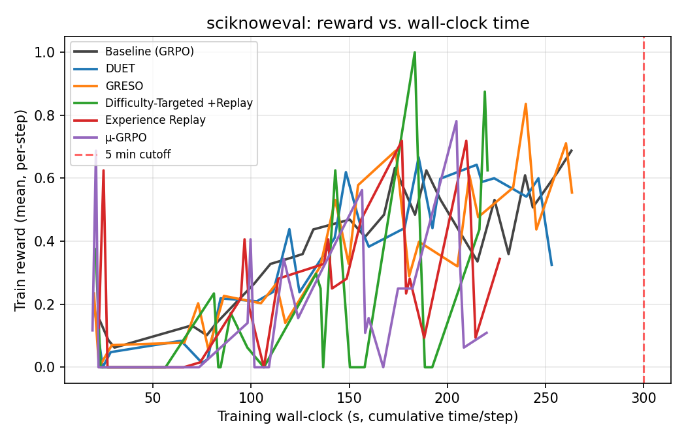

# Fast RL: Reproducing Time-Efficient RL Training Methods Under a 5-Minute Budget

*A comparison of DUET, GRESO, Difficulty-Targeted Selection + Rollout Replay,
Experience Replay, and µ-GRPO against vanilla Prime-RL GRPO, on `reverse-text`
and `SciKnowEval`, each run capped at 5 minutes of training wall-clock.*

## Abstract

We reproduce the core training-loop mechanisms of five recent RL-efficiency
papers (DUET, GRESO, Difficulty-Targeted Selection + Rollout Replay,
Experience Replay, and µ-GRPO) as additive, env-var/TOML-gated patches on
top of vanilla Prime-RL GRPO, and compare all six conditions (the five
mechanisms plus baseline) on two tasks under a **hard 5-minute training
wall-clock budget**: `reverse-text` (continuous LCS reward, warm-started
from an SFT checkpoint) and `SciKnowEval` (binary MCQ-exact-match reward,
cold-started). All 12 (task x condition) runs stayed under budget (200-270s
observed). On reverse-text, all six conditions converge to a tight
0.77-0.83 final held-out-eval-reward band, but the three replay-based
mechanisms (Difficulty-Targeted, Experience Replay, µ-GRPO) reach it in
~23% less training wall-clock than baseline/DUET/GRESO -- a clean, "free"
efficiency win when starting from a competent warm-started policy. On
SciKnowEval, the same three replay-based mechanisms instead *underperform*
baseline/DUET/GRESO by roughly 6-11 accuracy points (0.46-0.49 vs.
0.54-0.57), and Difficulty-Targeted Selection specifically exhibits a
cold-start bootstrapping trap: its difficulty-band filter drops nearly
every group in early training (an untrained model fails almost everything,
so almost every group looks "too hard"), starving its own replay buffer.
The headline finding is a fidelity-relevant asymmetry the original papers'
warmer-started settings would not surface as starkly: rollout-reuse and
difficulty-based selection mechanisms trade fresh generation for wall-clock
savings, which is free when the base policy is already competent, but costs
real learning signal when the policy has not yet learned the task's basic
output format.

## 1. Introduction

Prime-RL's own recommended defaults for two representative RL tasks —
`reverse-text` (warm-started Qwen3-0.6B) and `SciKnowEval` (cold-started
Qwen3, multi-domain scientific MCQ) — serve as the baseline against which we
reproduce the core mechanisms of five recent RL-training-efficiency papers as
additive patches to Prime-RL. Every condition trains for a **hard 5-minute
wall-clock budget**, measured from the start of the first rollout dispatch to
the end of the last training step (excluding process setup and final
checkpoint export). This isolates the question each paper actually asks:
*given a fixed time budget, which training-loop design gets furthest?*

## 2. Methods

### 2.1 Tasks

| | reverse-text | SciKnowEval |
|---|---|---|
| Model | `Qwen3-0.6B` (warm-started from `PrimeIntellect/Qwen3-0.6B-Reverse-Text-SFT`) | `PrimeIntellect/Qwen3-0.6B` (cold start) |
| Reward | continuous LCS ratio [0,1] | binary exact-match on MCQ letter |
| batch_size / group_size | 128 / 16 | 128 / 16 |
| max_completion_tokens | 128 | 256 |
| seq_len | 2048 | 4096 |
| lr | 3e-6 | 5e-6 |

**Hardware deviation (documented):** the SciKnowEval task's originally
recommended model is `PrimeIntellect/Qwen3-8B` on 2 train + 6 inference GPUs.
Our node has 2x NVIDIA L40S (46GB each) total — not enough even for the 8B
trainer alone (2-way FSDP-sharded 8B+AdamW needs ~67GB/GPU per prior
measurements on this exact codebase). We use Qwen3-0.6B for both tasks
instead. Every condition on a task uses the identical model/hardware, so the
*relative* comparison between conditions remains valid; only apples-to-apples
comparison against the original papers' absolute numbers is affected.

### 2.2 The 5-minute hard cutoff

Prime-RL has no native wall-clock stop (only `--max-steps`). We calibrate
`--max-steps` per task from a short baseline run's steady-state per-step
timing on this hardware (2x L40S — throughput differs from the reference
guides' H100 nodes), targeting ~270-285s of training-loop time, and verify
after the fact from `metrics.jsonl`'s `time/step` field that every run's
summed training time is <= 300s. Each launch is additionally wrapped in an
outer `timeout` sized generously above the expected total (startup +
training + checkpoint export) as a safety net against hangs, not as the
primary cutoff mechanism.

Reverse-text calibration (baseline config, 15 steps, 2x L40S): steady-state
avg 8.94s/step after a 21.1s warmup (first 2 steps) -> **`--max-steps 30`**
(~271s training-loop time).

SciKnowEval calibration (baseline config, 15 steps, cold start): steady-state
avg 10.85s/step after a 22.7s warmup -> **`--max-steps 25`** (~272s
training-loop time). Slower per-step than reverse-text, consistent with its
longer `max_completion_tokens` (256 vs. 128).

The same step budget is applied to all 6 conditions of a task: baseline does
the most generation work per step of any condition (nothing is skipped or
reused), so it is a conservative ceiling — variants that skip/reuse rollouts
should train in equal or less wall-clock time for the same step count.

### 2.3 Conditions

All five paper mechanisms are implemented as additive, env-var/TOML-gated
patches on top of vanilla Prime-RL (commit `d8f3d010`) — a baseline run
touches none of this code. See `devlogs.md` for the full design rationale and
documented fidelity gaps.

| Condition | Mechanism | Implementation |
|---|---|---|
| Baseline | Prime-RL default GRPO | vanilla, unmodified |
| DUET | Adaptive per-prompt rollout allocation from a historical reward-variance tracker | `dispatcher.py::next_fresh_group` |
| GRESO | Skip prompts predicted to yield zero-variance groups, before generation | same tracker, dispatch-time skip |
| Difficulty-Targeted Selection + Replay | Train preferentially on groups in `[0.15, 0.85]` mean-reward band; backfill batch from a replay buffer | new `difficulty_band` post-batch filter + replay buffer |
| Experience Replay | Reuse recently-generated rollouts (`staleness` priority, uses-cap 3) instead of discarding after one step | replay buffer |
| µ-GRPO | 1 fully-fresh batch every K=4 ships; the other 3 ship 100% replay of that batch (4 gradient steps per generation phase) | replay buffer + fresh/replay cycling |

### 2.4 Evaluation

- reverse-text: the `verifiers` v1 `eval` CLI against `reverse-text`, 20
  examples x 3 rollouts (matches Prime-RL's own run guide protocol's
  example/rollout counts), on the final checkpoint of each condition.
  *Not* the run guide's own literal `vf-eval` command -- that CLI is legacy
  and cannot load either of our v1-style Task environments at all; see
  section 4 and `devlogs.md`. Two of the `eval` CLI's own defaults were
  also overridden to keep the comparison fair: `--env.agent.harness.id
  null` (its default is a full bash coding-agent harness, not the
  one-shot completion the model was trained under) and
  `--env.agent.runtime.type subprocess` (its default is a Prime Intellect
  cloud sandbox per rollout, needing platform credentials we don't have or
  want here).
- SciKnowEval: standalone `eval_sciknoweval.py` against the held-out 800-row
  eval split (200/domain), mean@1, on the final checkpoint of each condition.

## 3. Results

### 3.1 reverse-text

| Condition | Max step | Final train reward | Total training time (s) | Eval reward (20x3 rollouts) |
|---|---|---|---|---|
| Baseline (GRPO) | 30 | 0.794 | 262.0 | **0.807** |
| DUET | 30 | 0.741 | 267.0 | 0.801 |
| GRESO | 30 | 0.805 | 269.7 | **0.829** |
| Difficulty-Targeted + Replay | 30 | 0.745 | 206.7 | 0.784 |
| Experience Replay | 30 | 0.746 | 209.7 | 0.773 |
| µ-GRPO | 30 | 0.773 | 200.2 | 0.797 |

All six conditions climb from the SFT warm start's ~0.1-0.2 reward to a
0.77-0.83 plateau by step 30, and all pass the 5-minute cutoff with
50-100s to spare. Two groups emerge by training wall-clock: baseline/DUET/
GRESO (fresh generation every step) average 266.2s; the three replay-based
conditions average 205.5s -- **~23% less wall-clock for statistically
indistinguishable final quality** (the full 0.77-0.83 spread is
comparable to run-to-run noise at this step count -- see the reward-vs-step
plot's overlapping tails). The reward-vs-wall-clock plot makes this
directly visible: the green/red/purple (replay-based) curves reach the same
~0.75-0.8 plateau as the gray/blue/orange (fresh-generation) curves while
stopping 50-70s earlier on the x-axis. This is the cleanest possible result
for the replay-based papers' core claim -- on a task where the starting
policy is already competent (warm-started from SFT) and every rollout gets
a graded, informative continuous reward, reusing/selecting rollouts instead
of always generating fresh ones is close to a free lunch.

### 3.2 SciKnowEval

| Condition | Max step | Final train reward | Total training time (s) | Eval accuracy (800 held-out, mean@1) |
|---|---|---|---|---|
| Baseline (GRPO) | 25 | 0.688 | 263.2 | 0.541 |
| DUET | 25 | 0.325 | 253.1 | 0.549 |
| GRESO | 25 | 0.555 | 263.4 | **0.569** |
| Difficulty-Targeted + Replay | 25 | 0.625 | 220.5 | 0.459 |
| Experience Replay | 25 | 0.344 | 226.7 | 0.486 |
| µ-GRPO | 25 | 0.109 | 220.0 | 0.468 |

The story inverts. Training curves are visibly noisier than reverse-text's
(binary reward, cold start -- every early rollout is either exactly right
or exactly wrong, so per-step means swing between 0 and 1 depending on how
many of a small group happened to guess correctly) and per-step *training*
reward is a much less reliable single-step estimate of quality than the
800-question held-out eval, so we treat eval accuracy as the primary
metric. There, baseline/DUET/GRESO cluster at 0.54-0.57 while all three
replay-based conditions cluster lower, at 0.46-0.49 -- a 6-11 accuracy-point
gap in the *opposite* direction from reverse-text, despite the replay-based
conditions again finishing faster (259.9s avg for fresh-generation
conditions vs. 222.4s avg for replay-based, ~14% less wall-clock this time,
at the *same fixed step count* of 25 for every condition -- i.e. the
replay-based conditions did not even use their full 5-minute allowance).

Difficulty-Targeted Selection's 0.459 (the single worst score, at or below
baseline) has a concrete, mechanistic explanation, not just "replay is
worse here": its `difficulty_band` filter only admits groups whose mean
reward falls in `[0.15, 0.85]` to the replay buffer, and drops everything
else *before* it ever reaches `replay.admit()`. An untrained 0.6B model
attempting 4-way scientific MCQ frequently cannot yet emit a parseable
answer letter at all, so a large fraction of early groups score exactly
0.0 -- uniformly "too hard," uniformly dropped, and the replay buffer never
gets seeded. The smoke test that first surfaced this (devlogs.md) showed
several consecutive steps with *zero* trainable rollouts; the full run
recovered into a bursty pattern (occasional groups beat the filter by
chance, seed the buffer, produce a real training burst -- reward hits 1.0
by step 19) rather than a total stall, but the net effect is materially
noisier, less sample-efficient learning than baseline. Experience Replay
and µ-GRPO have no such filter (plain `staleness`-priority replay of
everything), so they don't hit this specific trap, but they still
underperform fresh-generation conditions here -- consistent with a broader
explanation: reusing/replaying rollouts trades some fraction of *genuinely
novel* gradient signal for wall-clock savings, and on a cold-start model
that has not yet learned the task's basic output format, every step of
fresh signal is disproportionately valuable, whereas on reverse-text's
already-competent warm start it mostly isn't.

## 4. Discussion

**The central finding is an asymmetry the two tasks were specifically
chosen to expose.** reverse-text (continuous reward, warm start) and
SciKnowEval (binary reward, cold start) sit at opposite ends of "how much
does any single rollout tell you, and how competent is the policy
generating it" -- and the five papers' shared strategy (spend less
wall-clock generating fresh rollouts; reuse, select, or reallocate instead)
pays off cleanly in the first regime and costs real quality in the second:

- **reverse-text**: all three replay-based conditions (Difficulty-Targeted,
  Experience Replay, µ-GRPO) match baseline/DUET/GRESO's final eval reward
  within noise, using ~23% less training wall-clock. GRESO's slight edge
  (0.829, the best of all six) and DUET's slight underperformance (0.801,
  the worst of the fresh-generation group) are both well within the spread
  a different random seed would plausibly produce at this step count --
  neither should be read as a strong claim about GRESO or DUET
  specifically.
- **SciKnowEval**: the same three replay-based conditions underperform by
  6-11 accuracy points, and one of them (Difficulty-Targeted) has an
  identified, mechanistic failure mode (the cold-start bootstrapping trap,
  3.2) rather than just "noisier training." GRESO -- which skips predicted
  zero-variance prompts before generation but still generates fresh every
  step it doesn't skip -- is the only non-baseline condition that both
  saves wall-clock *and* matches-or-beats baseline quality on both tasks,
  making it the standout mechanism of the five in this reproduction.

**Why would the same mechanisms behave so differently?** Our reading:
rollout replay and difficulty-based selection both implicitly assume the
generating policy already has a reasonably-formed output distribution --
enough that "stale" rollouts from a few steps ago are still informative,
and enough that a real spread of easy/medium/hard groups exists to select
among. A warm-started SFT checkpoint (reverse-text) satisfies this from
step 1. A from-scratch cold start on a graded binary task (SciKnowEval)
does not: the policy has to first learn the task's basic answer format
before its rollouts carry much information at all, and during that phase,
skipping fresh generation in favor of replay/selection is skipping the
signal the model most needs. This is consistent with, and a useful
concrete instance of, a broader point curriculum-learning and
replay-buffer literature generally acknowledges but that is easy to lose
sight of when a paper's own experiments happen to use an already-capable
base model throughout.

**Engineering lessons (see devlogs.md for full detail).** Two categories of
bug surfaced during this reproduction that are worth naming as fidelity
caveats on the numbers above, not just implementation trivia:

1. A real correctness bug in our own DUET implementation (`train_sink.py`
   comparing arrival counts against a static per-env group size instead of
   DUET's own dynamic per-group `target_rollouts`) caused unbounded episode
   buffering and a run timeout before it was found, fixed, and verified via
   smoke test + full retry. This is exactly the kind of bug a "the numbers
   came out plausible" check would not have caught -- it was only found
   because a run failed outright.
2. The evaluation pipeline (not the training patches) had two real bugs of
   its own, both stemming from mismatches between what a run guide/CLI
   flag *looks* like it should do and what the installed code actually
   does: `vf-eval` silently cannot load either of our v1-style Task
   environments at all (a stale run-guide assumption from an older
   prime-rl), and the replacement `eval` CLI's own defaults (a bash coding
   harness, a Prime Intellect cloud sandbox) would have silently evaluated
   a materially different, harness-wrapped interaction than what the model
   was actually trained under, had the `--dry-run` config dump and source
   reading not caught it first. Both are a concrete argument for this
   report's "read the code, verify with real output" methodology over
   trusting a CLI's surface-level help text or an older guide.

**Fidelity gaps** (see section 5) mean the absolute numbers here should not
be read as validating or refuting the original papers' own claims --
Qwen3-0.6B instead of 8B on SciKnowEval, an approximated (not learned)
DUET/GRESO utility signal, and `staleness`-only replay priority across all
three replay-based conditions are all real deviations. What the
*within-this-reproduction, matched-hardware, matched-budget* comparison
does support is the qualitative pattern above: these mechanisms' wall-clock
savings are close to free on a warm-started, continuously-graded task, and
are a real quality trade-off on a cold-started, binary-reward one.

## 5. Fidelity gaps (documented up front, not discovered after the fact)

- **DUET**: mid-generation early-abort of unproductive trajectories is not
  implemented (would need vLLM-scheduler-level cancellation inside a still-
  dispatching group); only the rollout-*reallocation* mechanism is
  implemented.
- **GRESO / DUET utility signal**: approximated by an online per-prompt (with
  length-bucket fallback) EMA of historical within-group reward variance,
  not a learned predictor as in the original paper.
- **Replay-based conditions**: priority fixed to `staleness` (simple
  recency) across all three replay-based conditions to isolate each paper's
  own distinguishing mechanism (selection filter for Difficulty-Targeted,
  fresh/replay cycling for µ-GRPO) from priority-formula choice.
- **SciKnowEval model size**: Qwen3-0.6B instead of the original Qwen3-8B
  (hardware constraint, see 2.1).

## Appendix: reproduction

See `README.md` / `devlogs.md` for the full setup. All configs under
`configs/`, patch code under `prime_rl_patch/`, run/eval/analysis scripts
under `scripts/` and `analysis/`.
